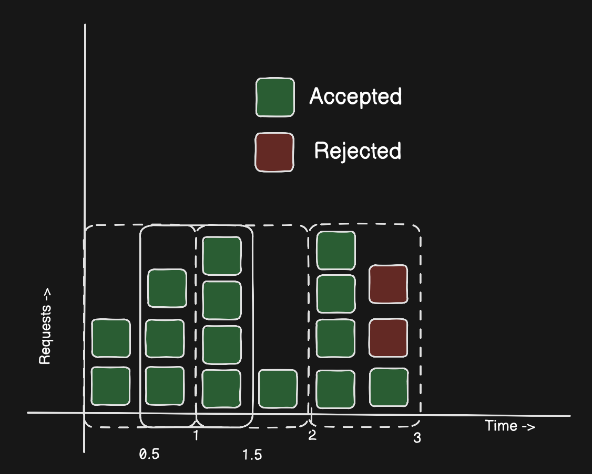
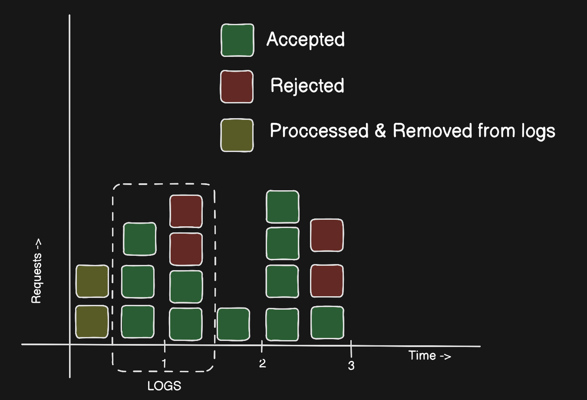
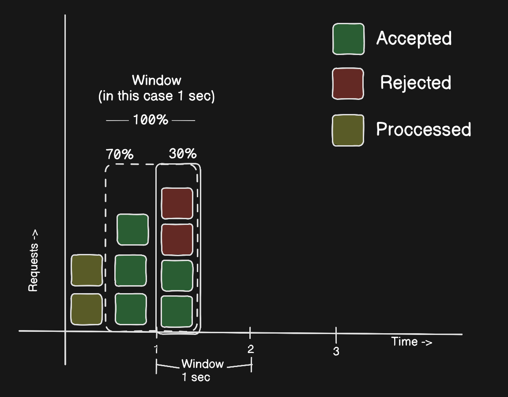
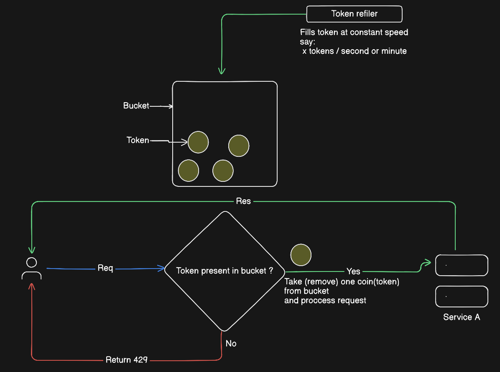
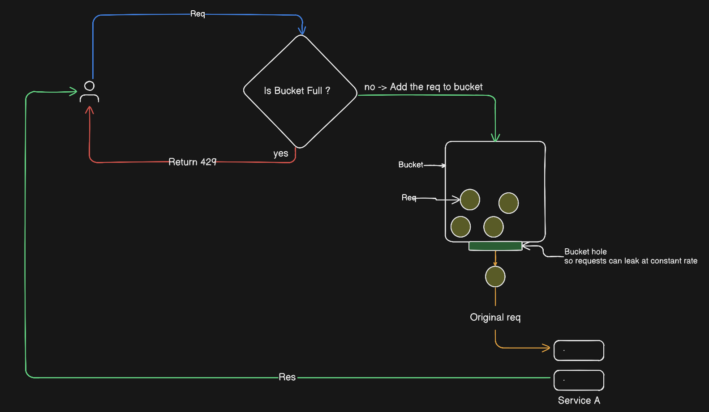

# Rate Limiting Algorithms — Deep Dive

This document explains the **five rate limiting algorithms** implemented in this project, their **tradeoffs**, and **when to use each one**.

All algorithms are implemented **from scratch** using Redis.

---

## ❓ What is Rate Limiting?

Rate limiting controls **how many requests** a client can make within a given time frame to:

- prevent abuse
- protect services
- ensure fair usage
- smooth traffic spikes

---

## 🧠 Design Principles Used

- Distributed-safe (Redis-backed)
- Per-user / per-IP tracking
- No background timers (`setInterval`)
- Time-based calculations instead of polling
- Fail-open gateway design

---

## 1️⃣ Fixed Window Counter

### How it works
- Time is divided into fixed windows (e.g., 60 seconds)
- A counter tracks requests per window
- Counter resets when window expires

````

|----window----|----window----|

````

### Pros
- Simple to implement
- Low memory usage

### Cons
- Allows burst at window boundaries

### Best for
- Login / OTP endpoints
- Simple abuse prevention

> 📌 Diagram: Fixed Window Counter Algorithm


---

## 2️⃣ Sliding Window Log

### How it works
- Stores timestamps of each request
- Removes timestamps older than window
- Counts remaining timestamps

```

[now - window ........ now]

```

### Pros
- Very accurate
- No boundary burst issue

### Cons
- High memory usage
- Not suitable for high traffic APIs

### Best for
- Low traffic, accuracy-critical endpoints

> 📌 Diagram: Sliding Window Log Algorithm


---

## 3️⃣ Sliding Window Counter

### How it works
- Uses **two windows**: current + previous
- Counts requests in both
- Applies a **weighted overlap**

```js

effectiveCount = currCount + prevCount * weight
// where weight = (windowSize - elapsed) / windowSize
// & elapsed = now % windowSize

```

### Pros
- Much more memory-efficient than log
- Smooths window boundaries

### Cons
- Approximate, not exact

### Best for
- High traffic APIs
- Real-world production systems

> 📌 Diagram: Sliding Window Counter Algorithm


---

## 4️⃣ Token Bucket

### How it works
- Each client has a bucket of tokens
- Tokens refill at a fixed rate
- Each request consumes 1 token

```

[ Tokens Refill ] ---> [ Bucket ] ---> Request

```

### Pros
- Allows bursts
- Smooth long-term rate
- Very popular in API gateways

### Cons
- Slightly complex time bookkeeping

### Best for
- Public APIs
- Search endpoints
- User-facing services

> 📌 Diagram: Token Bucket Algorithm


---

## 5️⃣ Leaky Bucket

### How it works
- Requests fill a bucket
- Bucket leaks at a constant rate
- If bucket is full → reject

```

Requests --> [ Bucket ] --> Constant Output

```

### Pros
- Smooths traffic perfectly
- Protects downstream systems

### Cons
- No burst tolerance
- Poor UX for public APIs

### Best for
- Internal services
- Background workers
- Message processing pipelines

> 📌 Diagram: Leaky Bucket Algorithm


---

## 🆚 Algorithm Comparison

| Algorithm | Burst | Accuracy | Memory | Production Use |
|--------|-------|----------|--------|----------------|
| Fixed Window | ❌ | Low | Low | Medium |
| Sliding Log | ❌ | High | High | Low |
| Sliding Counter | ❌ | Medium | Low | High |
| Token Bucket | ✅ | Medium | Low | Very High |
| Leaky Bucket | ❌ | Medium | Low | Medium |

---

## 🧠 Final Thoughts

- No algorithm is universally best
- Real systems choose based on traffic behavior
- Supporting multiple strategies is the most flexible approach

This project demonstrates **how real API gateways think about rate limiting**.

---

## 📌 Future Improvements

- Redis Lua scripts for atomicity
- API key-based limits
- Tiered user limits
